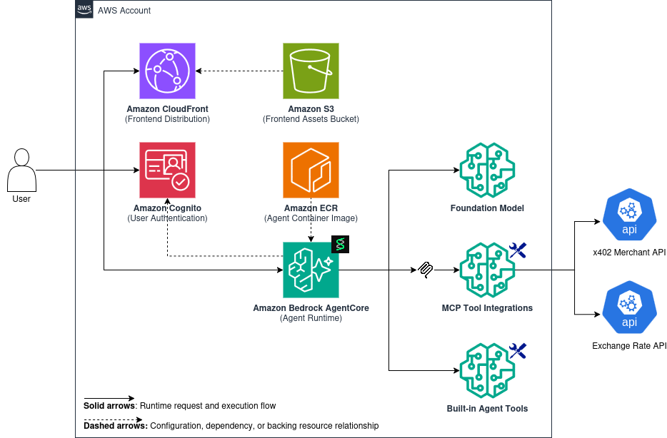
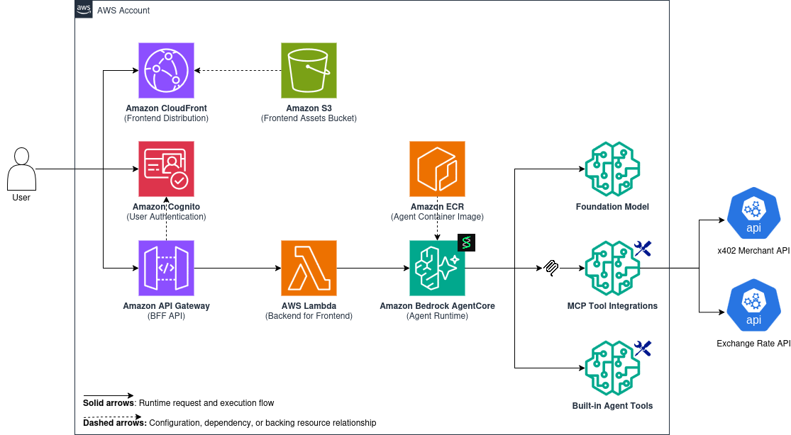

# Strands Agents in TypeScript on Amazon Bedrock AgentCore

Reference repository for deploying and integrating Strands Agents in TypeScript with Amazon Bedrock AgentCore Runtime.

This project demonstrates two common integration patterns for real applications:

* **Frontend → AgentCore Runtime**
* **Frontend → BFF → AgentCore Runtime**

It is designed for anyone looking for a practical starting point to quickly deploy the stack, understand the architecture, and adapt it to their own use case.

## What this repository includes

* A Strands-based agent running on Amazon Bedrock AgentCore Runtime
* A React chatbot frontend
* An AWS Lambda-based BFF for proxied integration
* Amazon Cognito authentication for browser access
* AWS CDK infrastructure for runtime, auth, frontend hosting, and BFF

## Prerequisites

Before deploying, make sure you have:

* Node.js 22+
* npm 10+
* Docker with Buildx enabled
* AWS credentials configured for the target account
* Access to Amazon Bedrock AgentCore Runtime
* Access to the model configured by `BEDROCK_MODEL_ID`

## Quick start

### 1. Install dependencies

```bash
npm run bootstrap
```

### 2. Configure infrastructure variables

```bash
cp infra/.env.example infra/.env
```

### 3. Deploy the stack

```bash
npm run deploy
```

This command deploys the infrastructure through `infra/` and builds the required application artifacts as part of the deployment flow.

For deployment details and environment-specific options, see [infra/README.md](infra/README.md).

## Architecture

### Option 1 — Frontend calls AgentCore directly



* Browser authenticates with Cognito
* Frontend invokes AgentCore directly with a bearer token
* Streaming responses are handled in the frontend

### Option 2 — Frontend calls a BFF



* Browser authenticates with Cognito
* Frontend sends requests to a Lambda-based BFF
* The BFF invokes AgentCore and re-streams responses to the frontend

## Repository structure

```text
agent/               Strands agent runtime, MCP integrations, and container build context
chatbot-frontend/    React + Vite chatbot UI
chatbot-bff/         Lambda-friendly BFF for AgentCore invocation
infra/               AWS CDK app for runtime, auth, frontend hosting, and BFF
```

Additional package documentation:

* [agent/README.md](agent/README.md)
* [chatbot-frontend/README.md](chatbot-frontend/README.md)
* [chatbot-bff/README.md](chatbot-bff/README.md)
* [infra/README.md](infra/README.md)

## Deployment configuration

For infrastructure deployment, only the following file is required:

* `infra/.env`

See [infra/.env.example](infra/.env.example) for the available settings.

## Local development configuration

Package-level `.env` files are only needed when running components locally:

* `agent/.env`
* `chatbot-bff/.env`
* `chatbot-frontend/.env`

You can create them from the provided examples when needed:

```bash
cp agent/.env.example agent/.env
cp chatbot-bff/.env.example chatbot-bff/.env
cp chatbot-frontend/.env.example chatbot-frontend/.env
```

Important configuration switches:

* `VITE_AGENT_MODE` — frontend integration mode
* `AGENT_AUTH_MODE` — deployment/auth mode used by the infrastructure

See each package’s `.env.example` file for the full list of settings.

## Local development

Typical local workflow:

1. Start the local agent from `agent/`
2. Start the BFF from `chatbot-bff/` when testing BFF mode
3. Start the frontend from `chatbot-frontend/`

Use the package-specific READMEs for local commands and development details.

## Root scripts

The root package provides a small set of convenience commands for common workflows.

| Script                       | Purpose                                                              |
| ---------------------------- | -------------------------------------------------------------------- |
| `npm run bootstrap`          | Install locked dependencies for the root package and each subpackage |
| `npm run lint`               | Run repository-wide ESLint checks                                    |
| `npm run synth`              | Build deployable artifacts and synthesize the CDK app                |
| `npm run deploy`             | Deploy all infrastructure                                            |
| `npm run destroy`            | Destroy all deployed stacks                                          |
| `npm run docker:setup-arm64` | Enable local ARM64 Docker emulation for agent image builds           |

## Deployment notes

The CDK app in `infra/` provisions:

* Amazon Cognito
* Amazon Bedrock AgentCore Runtime
* Lambda-based BFF
* Static frontend hosting

Additional notes:

* `npm run deploy` builds the frontend and BFF before deployment
* The agent image defaults to `linux/arm64`
* The frontend receives runtime configuration through `config.js`

## Troubleshooting

### Docker ARM64 build fails with `exec format error`

If the agent image build fails during deployment, run:

```bash
cd infra
npm run docker:setup-arm64
```

Then retry:

```bash
cd ..
npm run deploy
```

## Production readiness

This repository is a reference implementation, not a production-ready template.

For a production gap analysis, see [assessment.md](assessment.md).

## Usage guidance

Use this repository as:

* a reference for AgentCore integration patterns
* a starting point for an internal hardened template
